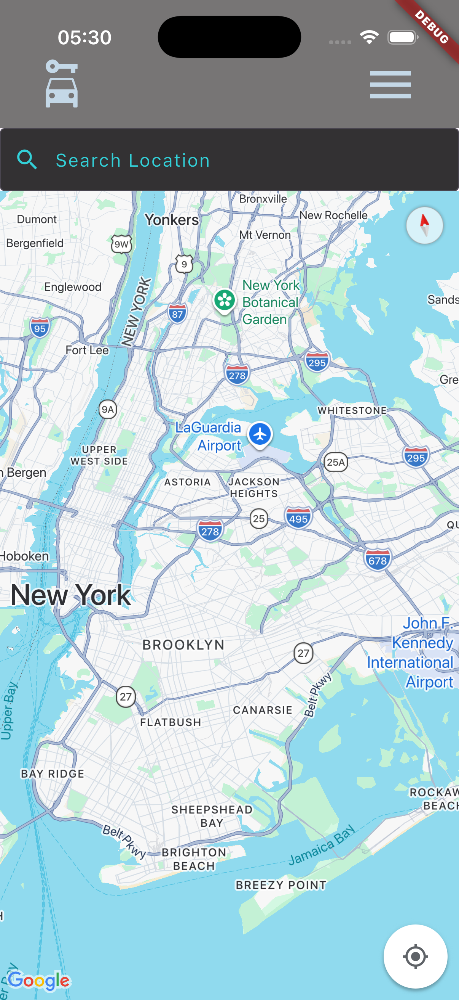

# ParkerUp
 
A community-driven peer-to-peer parking navigation mobile app built with Flutter and Dart. ParkerUp helps users find and share parking spots in real time, powered by Google Cloud and navigation APIs.
 
---
 
## 📋 Table of Contents
 
- [Prerequisites](#prerequisites)
- [Getting Started](#getting-started)
- [Environment Variables](#environment-variables)
- [Running Locally](#running-locally)
- [Screenshots](#screenshots)
- [Tech Stack](#tech-stack)
- [License](#license)
 
---
 
## Prerequisites
 
Before you begin, ensure you have the following installed on your machine:
 
- [Flutter](https://docs.flutter.dev/get-started/install) (latest stable version recommended)
- [Dart](https://dart.dev/get-dart) (comes bundled with Flutter)
- [Xcode](https://developer.apple.com/xcode/) (required for iOS Simulator — macOS only)
- [iOS Simulator](https://developer.apple.com/documentation/xcode/running-your-app-in-simulator-or-on-a-device) (set up via Xcode)
 
> **Note:** To verify your Flutter setup is complete, run `flutter doctor` in your terminal and resolve any reported issues before proceeding.
 
---
 
## Getting Started
 
### 1. Clone the Repository
 
```bash
git clone https://github.com/your-username/parkerup.git
cd parkerup
```
 
### 2. Install Dependencies
 
```bash
flutter pub get
```
 
### 3. Set Up Environment Variables
 
Create a `.env` file in the root of the project and add the following variables:
 
```env
GOOGLE_CLOUD_API_KEY=your_google_cloud_api_key_here
GOOGLE_MAPS_API_KEY=your_google_maps_api_key_here
FIREBASE_API_KEY=your_firebase_api_key_here
FIREBASE_AUTH_DOMAIN=your_project_id.firebaseapp.com
FIREBASE_PROJECT_ID=your_firebase_project_id_here
```
 
> **How to get these values:** Log in to the [Google Cloud Console](https://console.cloud.google.com/), create or select a project, and enable the **Maps SDK for iOS** and any other required APIs. Then navigate to **APIs & Services > Credentials** to generate your API keys. For Firebase, go to the [Firebase Console](https://console.firebase.google.com/), select your project, and navigate to **Project Settings** to find your Firebase config values.
 
> ⚠️ **Never commit your `.env` file to version control.** Make sure `.env` is listed in your `.gitignore`.
 
### 4. Start the iOS Simulator
 
Open Xcode, navigate to **Xcode > Open Developer Tool > Simulator**, and boot your preferred iOS device.
 
---
 
## Running Locally
 
Once the simulator is running, start the app with:
 
```bash
flutter run
```
 
The app will automatically launch in the iOS Simulator.
 
---
 
## Environment Variables
 
| Variable | Description |
|---|---|
| `GOOGLE_CLOUD_API_KEY` | Your Google Cloud project API key |
| `GOOGLE_MAPS_API_KEY` | Your Google Maps / Navigation API key |
| `FIREBASE_API_KEY` | Your Firebase project API key |
| `FIREBASE_AUTH_DOMAIN` | Your Firebase authentication domain |
| `FIREBASE_PROJECT_ID` | Your Firebase project ID |
 
---
 
## Screenshots
  
### Home Screen

 
### Map View

 
### Car Detail

 

## Tech Stack
 
| Technology | Purpose |
|---|---|
| [Flutter](https://flutter.dev/) | Cross-platform mobile framework |
| [Dart](https://dart.dev/) | Programming language |
| [Google Cloud](https://cloud.google.com/) | Cloud infrastructure & APIs |
| [Google Maps API](https://developers.google.com/maps) | Mapping & navigation |
| [Firebase](https://firebase.google.com/) | Authentication & backend services |
 
---
 
## License
 
© 2026 ParkerUp. All Rights Reserved.
 
This project and its source code are the exclusive property of ParkerUp. No part of this codebase may be reproduced, distributed, modified, or used in any form without the express written permission of the owner.
 
Unauthorized copying, forking, or reuse of this code, in whole or in part, is strictly prohibited.
 
